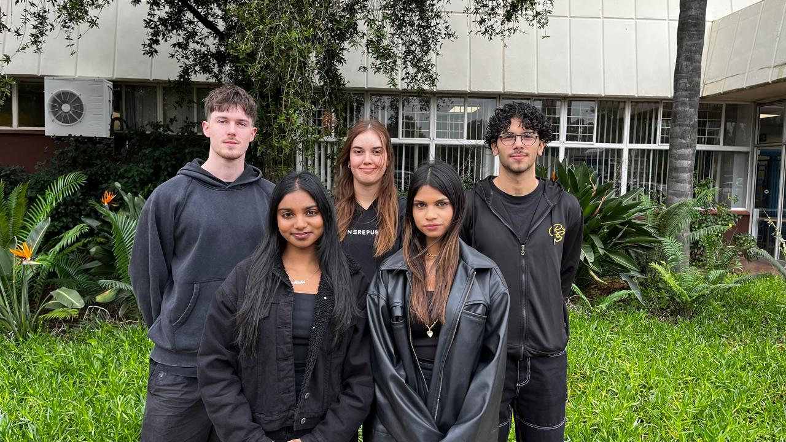
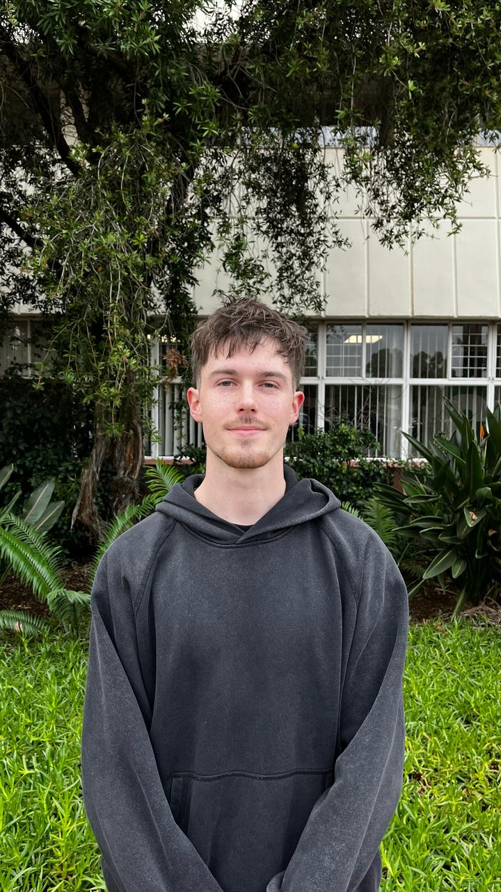
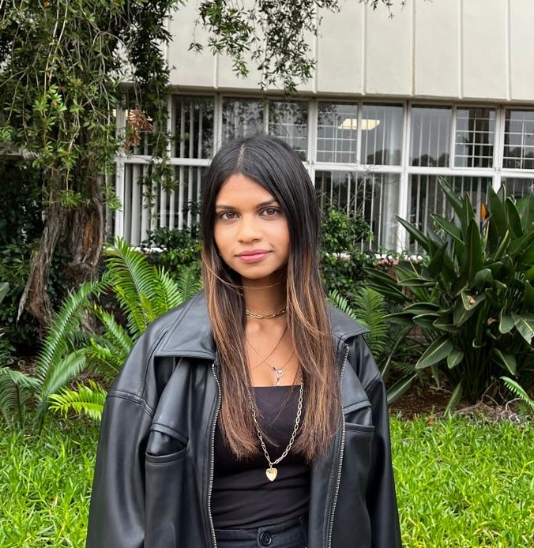
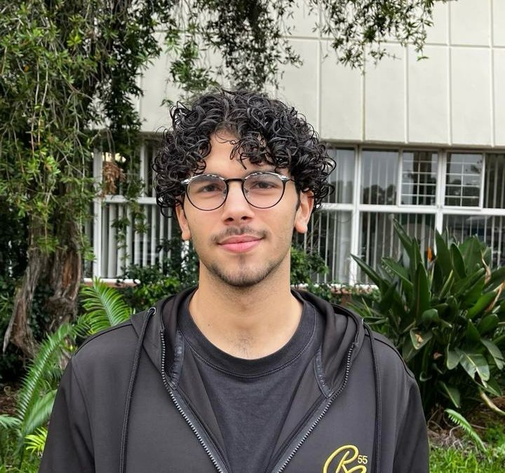
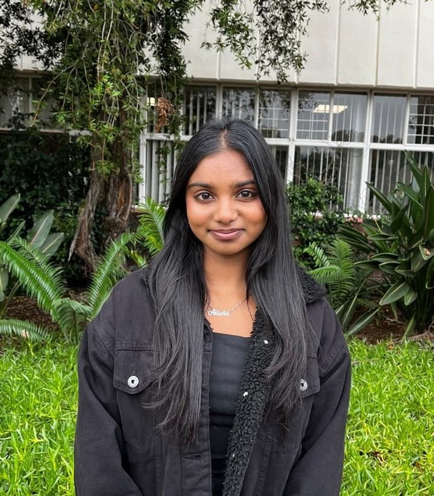
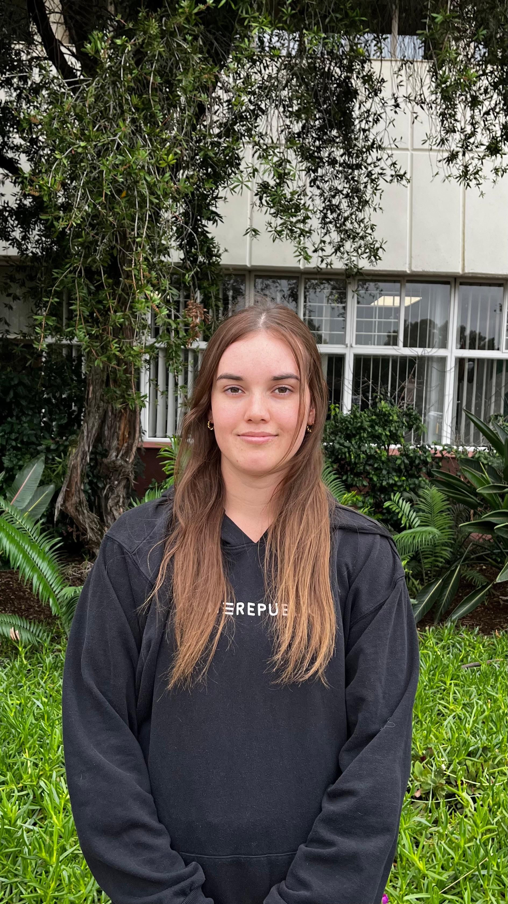

  <h1 align="center">A Capstone Project for
   <a href="https://www.epiuse.com">
Epi-Use Africa     </a>
  </h1>

<h3 align="center">
  Weather to Wear is a web-application that aims to
simplify weather forecasts into a personalized wardrobe
consultant. By analysing real-time weather forecasts
with the combination of a user's personalised styling
preferences, it uses AI-driven outfit suggestions to
provide appropriate fashion recommendations from a
user's personal clothing collection. The application
seeks to streamline the daily challenge of choosing
outfits that are weather-appropriate, ensuring users
step out confidently prepared for any weather condition
while expressing their unique fashion sense. 
</h3>

[Visit our site](https://weather-to-wear.com/) 

  <h1 align="center"> Documentation and Resources </h1>
  

| Resource                             | Description                                                                                                                         |
|--------------------------------------|-------------------------------------------------------------------------------------------------------------------------------------|
| [SRS - Architectural Requirements Document](docs/demo4/Architecture%20Document.pdf)             | System design overview                     |
| [Coding Standards Document](docs/demo4/Coding%20Standards.pdf)           |  Guidelines for writing code      |
| [Testing Policy](https://github.com/COS301-SE-2025/Weather-to-Wear/wiki/See-our-Testing-Here#testing)           |  Guidelines for Testing     |
| [User Manual](docs/demo4/User%20Manual.pdf)           |  Guidelines for using Weather To Wear      |
| [Technical Installation](docs/demo4/Technical%20Installation.pdf)                        | Guidelines for installing Weather To Wear              |
| [Deployment Model](docs/demo4/Deployment%20Diagram%20Description%20(1).pdf)                   | Description of Deployment Model                |
| [Service Contracts](docs/demo4/Service%20Contract%20(4).pdf)           |  Service contracts for Weather to Wear     |
| [Project Board](https://github.com/COS301-SE-2025/Weather-to-Wear/projects?query=is%3Aopen)                                                           | Team organisation and progress tracking    |
| [Tender Document Proposal](https://drive.google.com/file/d/16_RmKBtDhNpgXp95yghXMCpzRlVstp1S/view?usp=sharing)     | See our initial tender document   |
| [Previous Documentation](https://github.com/COS301-SE-2025/Weather-to-Wear/wiki/Previous-Documentation)     | See our previous documentation  |

<h1 align="center"> Demo Resources </h1>

| Demo                        | Video | Slides |
|---------------------------------|---------------------------------|---------------------------------|
| Demo 1 | [Demo 1 Video](https://drive.google.com/file/d/1GyHs1VCjNgNZzOnTfQ42bB9qiGFx9cDD/view?usp=drive_link) | [Demo 1 Slides](https://www.canva.com/design/DAGoo6VD59E/H3WMgCOqYhneGzFKsbAXyA/edit?utm_content=DAGoo6VD59E&utm_campaign=designshare&utm_medium=link2&utm_source=sharebutton) |
| Demo 2 | [Demo 2 Video](https://drive.google.com/file/d/1KGmEKBSlrwvg-jyh0UD6E8v92oZqQfoY/view?usp=sharing) | [Demo 2 Slides](https://www.canva.com/design/DAGrdP6mmEo/M21LCP-2bE7OZnUnH_WtqQ/edit?utm_content=DAGrdP6mmEo&utm_campaign=designshare&utm_medium=link2&utm_source=sharebutton) |
| Demo 3 | [Demo 3 Video](https://drive.google.com/file/d/1l9zM6gVoOu1_PHj3VN0-MpvKMGhCRAob/view?usp=sharing) | [Demo 3 Slides](https://drive.google.com/file/d/1fxbzPkf-n0Bbjb-JeXmzErP_y-l3ikdM/view?usp=drive_link) |
| Demo 4 | [Demo 4 Video](https://drive.google.com/file/d/176BHmsyvkqqzTDMhl-kp-5iz1VFNhPC8/view?usp=sharing) | [Demo 4 Slides](docs/demo4/DEMO4Slides.pdf) |

  <h1 align="center">Technologies </h1>
  

Frontend

  

Backend

    

Project Management & Deployment

   

Testing

    
  

 

<h1 align="center">Meet The Team</h1>

[Our Team Website](https://gitgood.netlify.app/) 

  

<table style="border-width: 1px; width: 100%; font-family: Arial, sans-serif; border-collapse: collapse;">
  <tr>
    <td style="vertical-align: top; width:auto; border: 0; padding: 10px;">
 
    </td>
    <td style="vertical-align: top; width: auto; border: 0; padding: 10px;">
      <h2><b style="font-size: 18px;">Kyle Liebenberg
</b></h2>
      <h3><b style="font-size: 16px;">Project Manager, Services Engineer, Data Engineer, DevOps</b></h3> 
       I am a final year Computer Science student, and have been working with computers and programming for over 7 years. I enjoy mathematics and problem solving which has been my driving force to enter this field of study. Recently, my interest has expanded into the world of Artificial Intelligence, where I am excited to explore how systems can solve real-world problems. When I'm not working I'm probably at the gym, playing pool, losing in chess, but most likely am fast asleep.
        
      
      
    </td>
  </tr>

 
  <tr>
    <td style="vertical-align: top; width:auto; border: 0; padding: 10px;">
      
    </td>
    <td style="vertical-align: top; width: auto; border: 0; padding: 10px;">
      <h2><b style="font-size: 18px;">Diya Budhia</b></h2>
      <h3><b style="font-size: 16px;">Architect, UI Designer, Integration Engineer, Testing Engineer</b></h3> 
     I am currently a 3rd-year Computer Science student with a
passion for software development, coding, and creating
new and exciting things. I'm always eager to learn new
technologies and take on challenges that help me grow as
a developer. Outside of my academic and professional
interests, I enjoy a variety of hobbies including drumming,
running, and creating art, which help me stay creative and
balanced.
        
      
      
    </td>
  </tr>

  <tr>
    <td style="vertical-align: top; width:auto; border: 0; padding: 10px;">
      
    </td>
    <td style="vertical-align: top; width: auto; border: 0; padding: 10px;">
      <h2><b style="font-size: 18px;">Ibrahim Said</b></h2>
      <h3><b style="font-size: 16px;">Architect, DevOps, Integration Engineer, Services Engineer, Testing Engineer, Data Engineer</b></h3> 
      As a final year Computer Science student, I enjoy
developing scalable, secure, and high-performance
systems. Since I started coding, I’ve found the process of
turning caffeine and sleepless nights into a working
program thrilling (for the most part!). My passion for
programming drives me to bring innovative and
dependable solutions to life! Outside of debugging code for
hours, I enjoy staying active by indulging in my hobbies,
including Kickboxing, bowling, and gym.
        
      
      
    </td>
  </tr>

  <tr>
    <td style="vertical-align: top; width:auto; border: 0; padding: 10px;">
      
    </td>
    <td style="vertical-align: top; width: auto; border: 0; padding: 10px;">
      <h2><b style="font-size: 18px;">Alisha Perumal</b></h2>
      <h3><b style="font-size: 16px;">Architect, UI Engineer, DevOps, Business Analyst, Testing Engineer, Integration Engineer</b></h3> 
     I am a final year computer science student with a passion
for computers and a curiosity about all things virtual,
including virtual worlds and their underlying systems. I am
deeply engaged in honing my skills and evolving as a
software developer and engineer. My fascination with
technology combined with my love for problem-solving,
has driven me to pursue a career in Software Development.
In my free time, i enjoy going to the gym, cooking for
friends and family, and hiking.
        
      
      
    </td>
  </tr>

  <tr>
    <td style="vertical-align: top; width:auto; border: 0; padding: 10px;">
      
    </td>
    <td style="vertical-align: top; width: auto; border: 0; padding: 10px;">
      <h2><b style="font-size: 18px;">Taylor Sergal
</b></h2>
      <h3><b style="font-size: 16px;">UI Engineer, Testing Engineer, Business Analyst, Integration Engineer</b></h3> 
      I am a final year BSc Computer Science student with a
passion for frontend development and design. I am eager
to create systems that not only enhance user interaction
but overall user experience by utilizing the skills that I have
learnt along my educational journey. My personal interests
include reading, hanging out with friends and going to the
gym, allowing me to maintain a healthy work-life balance.
        
      
      
    </td>
  </tr>
</table>
