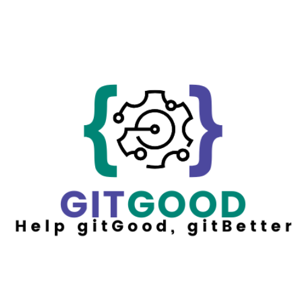

<!-- ──────────────────────────────── HEADER ──────────────────────────────── -->

<p align="center">
  
</p>

<h1 align="center">Weather&nbsp;-&nbsp;to&nbsp;-&nbsp;Wear</h1>

<p align="center">
  AI-powered outfit recommendations driven by real-time weather data.<br/>
  <em>University of Pretoria – COS&nbsp;301 Capstone Project (2025)</em>
</p>

<p align="center">
  <!-- CI badge – becomes green once the workflow file exists -->
  <a href="https://github.com/COS301-SE-2025/Weather-to-Wear/actions/workflows/ci.yml">
    
  </a>
  
</p>

---

## ℹ️ Overview

**Weather-to-Wear** is a progressive web app (PWA) and micro-service backend that:

* imports your personal wardrobe via quick photo capture,  
* pulls local forecasts from dual weather APIs,  
* runs an on-device ML model to rank outfits (with layering advice),  
* learns from your 1-5 star rating feedback, and  
* lets you share your style with friends in a real-time social feed.

The goal: **make “What should I wear today?” obsolete**—no matter the season, location, or schedule.

---

## 👥 Team

| Photo | Name | Role | LinkedIn |
|-------|------|------|----------|
|  | **Kyle Liebenberg** | Team lead, Scrum Master, Services & Data Engineer, DevOps | [linkedin.com/in/kyle-liebenberg-19a315325/](https://www.linkedin.com/in/kyle-liebenberg-19a315325/) |
|  | **Diya Budhia** | Architect, Designer, Integration Engineer, UI Engineer | [linkedin.com/in/diya-budhia-a9124a355/](https://www.linkedin.com/in/diya-budhia-a9124a355/) |
|  | **Ibrahim Said** | Architect, Integration Engineer, Data Engineer, DevOps | [linkedin.com/in/ibrahim-said-908156356/](https://www.linkedin.com/in/ibrahim-said-908156356/) |
|  | **Alisha Perumal** | Documentation, Designer, UI engineer, DevOps  | [linkedin.com/in/alisha-perumal-6b31bb356/](https://www.linkedin.com/in/alisha-perumal-6b31bb356/) |
|  | **Taylor Sergel** | UI Engineer, Designer, Documentation  | [linkedin.com/in/taylor-sergel-aa267a354/](https://www.linkedin.com/in/taylor-sergel-aa267a354/) |

---

## 🗂️ Monorepo layout

| Path | Purpose |
|------|---------|
| `app-mobile/` | React Native + Expo PWA (front-end) |
| `app-backend/` | Node.js micro-services (API Gateway, Wardrobe, Weather Adapter, Recommender, Social) |
| `infra/` | Docker Compose, deployment manifests, IaC scripts |
| `docs/` | Architecture diagrams, meeting minutes, user-story backlog |
| `.github/workflows/` | CI/CD pipelines |

---

## 🚀 Quick start (local development)

```bash
# 1. Clone
git clone https://github.com/COS301-SE-2025/Weather-to-Wear.git
cd Weather-to-Wear

# 2. Install workspace dependencies
pnpm install          # or npm install

# 3. Spin up services + mobile in parallel
pnpm dev              # via Turborepo / concurrently script
```
